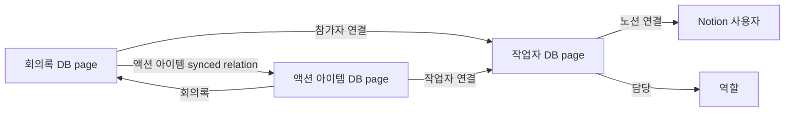

# Dirong Notion DB 구조

작성일: 2026-05-10

이 문서는 Dirong이 Notion에 생성하고 관리할 기본 DB 세트의 구조를 정리한다.
목표는 코딩을 모르는 사용자도 부모 page 하나를 공유하고 버튼을 눌러 사용할 수
있는 Notion 구성을 만드는 것이다.

## 설계 원칙

- 환경변수로 필드 이름을 늘리지 않는다.
- 사용자가 보는 기본 필드명은 한국어 preset을 우선한다.
- 코드는 필드명을 직접 기준으로 삼지 않고 내부 의미 키로 처리한다.
- Dirong이 만든 필수 필드는 삭제, 타입 변경, 의미 변경을 막는다.
- 사용자는 각 DB에 커스텀 필드를 추가할 수 있다.
- 기존 DB 가져오기는 고급 기능으로 미룬다. 기본 흐름은 Dirong이 새 DB 세트를
  생성하는 것이다.

## 기본 DB 세트

Dirong은 사용자가 공유한 부모 page 아래에 다음 DB를 만든다.

```text
부모 page
├─ 회의록
├─ 작업자
└─ 액션 아이템
```

대시보드에서는 탭 형태로 관리한다.

```text
회의록 | 작업자 | 액션 아이템 | +
```

## 내부 의미 키

Notion 필드명은 언어 preset에 따라 바뀔 수 있으므로, 코드는 내부 의미 키를
저장해서 사용한다.

예:

| 의미 키 | 한국어 필드명 |
|---------|----------------|
| `meeting.title` | `회의록` |
| `meeting.memberRelation` | `참가자 연결` |
| `meeting.participants` | `참가자` |
| `meeting.actionItems` | `액션 아이템` |
| `member.discordName` | `디스코드 닉네임` |
| `member.notionPerson` | `노션 연결` |
| `task.workerRelation` | `작업자 연결` |
| `task.assignee` | `담당자` |

## 회의록 DB

회의록 DB는 회의가 Notion에 업로드될 때 생성되는 page를 담는다.

| 의미 키 | 필드명 | 타입 | 시스템 동작 |
|---------|--------|------|-------------|
| `meeting.title` | `회의록` | title | 회의 제목을 쓴다. |
| `meeting.date` | `날짜` | date | 회의 시작일을 쓴다. |
| `meeting.time` | `회의 시간` | rich_text | 시작-종료 시간과 길이를 쓴다. |
| `meeting.channel` | `채널` | rich_text | Discord 음성 채널명을 쓴다. |
| `meeting.memberRelation` | `참가자 연결` | relation -> 작업자 | Discord 참가자를 작업자 DB page와 연결한다. |
| `meeting.participants` | `참가자` | rollup | `참가자 연결`의 `노션 연결`을 보여 준다. 직접 쓰지 않는다. |
| `meeting.actionItems` | `액션 아이템` | relation <- 액션 아이템.`회의록` | 이 회의에서 나온 작업 page를 보여 준다. |
| `meeting.status` | `상태` | status 또는 select | `draft`, `done`, `retry_wait`, `failed` 상태를 쓴다. |
| `meeting.sessionId` | `Dirong 세션 ID` | rich_text | 로컬 session id를 쓴다. |
| `meeting.draftId` | `Dirong 초안 ID` | rich_text | AI draft id를 쓴다. |
| `meeting.contentHash` | `Dirong 내용 해시` | rich_text | 중복/변경 감지용 hash를 쓴다. |
| `meeting.localStatus` | `Dirong 상태` | rich_text | 업로드 진행 상태를 쓴다. |

`참가자`는 사람이 보는 최종 참가자 필드다. Dirong은 `참가자` rollup을 직접
수정하지 않고, `참가자 연결` relation만 채운다.

`액션 아이템` relation은 Notion 표 셀에서 주로 작업 title만 보여 준다. 그래서
회의록 page 본문에는 업로드 시점의 액션 아이템 스냅샷 표도 함께 렌더링한다.
스냅샷 표는 회의록을 읽을 때 담당자, 담당, 마감일, 상태를 한 번에 보기 위한
요약이고, 최신 상태의 원본은 액션 아이템 DB다.

## 작업자 DB

작업자 DB는 프로젝트 단위의 사람/역할 사전이다.

| 의미 키 | 필드명 | 타입 | 시스템 동작 |
|---------|--------|------|-------------|
| `member.discordName` | `디스코드 닉네임` | title | 참가자와 담당자 매칭 기준으로 사용한다. |
| `member.notionPerson` | `노션 연결` | people | 실제 Notion 사용자를 사람이 지정한다. |
| `member.organization` | `소속` | select | 회사, 팀, 외부 파트너 등을 사람이 관리한다. |
| `member.roles` | `담당` | multi_select | 프로그래밍, 기획, UI/UX 등 역할을 사람이 관리한다. |

작업자 DB에는 `참여 상태`를 기본 필드로 두지 않는다. Dirong 기본 구조는
프로젝트별 작업자 DB를 전제로 하며, 이 DB에 있는 사람이 해당 프로젝트의
작업자다.

## 액션 아이템 DB

액션 아이템 DB는 AI draft의 `actionItems`를 Notion task page로 만든다.

| 의미 키 | 필드명 | 타입 | 시스템 동작 |
|---------|--------|------|-------------|
| `task.title` | `작업` | title | action item의 `task`를 쓴다. |
| `task.meeting` | `회의록` | relation -> 회의록 | 이 작업이 나온 회의록 page를 연결한다. |
| `task.workerRelation` | `작업자 연결` | relation -> 작업자 | 담당자 매칭 결과를 쓴다. 필요하면 화면에서 숨긴다. |
| `task.assignee` | `담당자` | rollup | `작업자 연결`의 `노션 연결`을 보여 준다. 직접 쓰지 않는다. |
| `task.role` | `담당` | rollup | `작업자 연결`의 `담당`을 보여 준다. 직접 쓰지 않는다. |
| `task.dueDate` | `마감일` | date | 명확한 마감일이 있을 때만 쓴다. |
| `task.status` | `상태` | status 또는 select | 옵션은 `할 일`, `진행 중`, `완료`다. 새 작업은 기본 `할 일`로 만든다. |
| `task.evidence` | `근거` | rich_text | 발화 근거 또는 시간 범위를 쓴다. |
| `task.sourceActionId` | `Dirong 액션 ID` | rich_text | 중복 생성 방지에 사용한다. |

`담당자`는 실제 Notion 사용자처럼 보이는 필드다. 시스템이 직접 사람 값을 쓰는
대신 `작업자 연결` relation을 쓰고, Notion rollup이 `담당자`를 계산한다.

## 관계 구조



## AI draft 생성 정책

AI에게 회의록 생성을 요청할 때는 다음 정보를 함께 전달한다.

- transcript는 음성을 Whisper/STT로 변환한 결과이며, 발음 문제로 오타나 잘못
  들은 단어가 있을 수 있다.
- AI는 문맥상 명확한 오타를 보정하되, 회의에 없는 사실을 새로 만들지 않는다.
- 회의 날짜를 `YYYY-MM-DD`, 요일, 가능하면 시작/종료 시각과 함께 전달한다.
- 마감일은 회의 날짜를 기준으로 계산 가능한 표현만 ISO date로 변환한다.

마감일 변환 예:

| 발화 | 처리 |
|------|------|
| `내일까지` | 회의 날짜 기준 다음 날로 변환 |
| `다음 주 월요일` | 회의 날짜와 요일 기준으로 변환 |
| `5월 15일까지` | 연도를 판단할 수 있으면 변환 |
| `빠르게`, `조만간`, `시간 될 때` | `unspecified`로 둠 |

## 업로드 동작

회의록 업로드:

1. Discord의 비봇 참가자 표시명을 읽는다.
2. 작업자 DB의 `디스코드 닉네임`과 매칭한다.
3. 매칭된 작업자 page를 회의록 DB의 `참가자 연결`에 쓴다.
4. 회의록 DB의 `참가자`는 Notion rollup이 자동으로 계산한다.
5. 회의록 page 본문에 액션 아이템 스냅샷 표를 렌더링한다.

액션 아이템 생성:

1. AI draft의 `actionItems`를 읽는다.
2. 각 item마다 `Dirong 액션 ID`로 기존 task를 찾는다.
3. 없으면 액션 아이템 DB page를 만든다.
4. `owner.name`이 명확하면 작업자 DB의 `디스코드 닉네임`으로 매칭한다.
5. 매칭되면 `작업자 연결`을 쓴다.
6. `담당자`와 `담당`은 Notion rollup이 자동으로 계산한다.
7. `dueDate.isoDate`가 있거나, 회의 날짜 기준으로 명확히 계산 가능하면
   `마감일`을 쓴다.
8. `상태`는 기본 `할 일`로 둔다.

담당자나 마감일이 불명확하면 추측해서 쓰지 않는다. 비워 두고 `근거`에 회의
발화 맥락만 남긴다. 특히 `빠르게`, `조만간`, `시간 될 때`, `다음 회의 전`처럼
일자를 계산할 근거가 부족한 표현은 마감일로 쓰지 않는다.

현재 구현된 안전장치:

- 회의록 DB는 healthy이고 액션 아이템 DB만 깨진 경우, 회의록 page는 업로드하고
  액션 아이템 page 생성만 건너뛰며 warning을 남긴다.
- 작업자 매칭이 없거나 여러 명으로 모호하면 `작업자 연결`을 비워 두고 task page는
  생성한다.
- 같은 draft를 다시 업로드하면 `Dirong 액션 ID`로 기존 task page를 갱신해 중복 생성을
  피한다.
- 필수 필드 누락/이름 변경/옵션 누락은 remote check 결과에서 diff로 표시하고, 사용자
  확인 후 복구한 항목만 SQLite mapping을 갱신한다.

## 커스텀 필드

각 DB는 커스텀 필드를 허용한다.

- 회의록 DB 커스텀 필드는 AI cleanup 결과나 고정 relation으로 채울 수 있다.
- 작업자 DB 커스텀 필드는 우선 사람이 Notion에서 관리하는 정보로 본다.
- 액션 아이템 DB 커스텀 필드는 추후 source 설정을 통해 AI draft나 고정값에서
  채울 수 있다.

필수 필드는 Dirong이 관리하므로 삭제하거나 의미를 바꾸지 않는다. 대시보드에서
필수 필드는 잠금 상태로 표시한다.

## 생성 UX

처음 설정의 최소 흐름:

1. 사용자가 Notion 부모 page URL을 입력한다.
2. Dirong integration이 해당 page에 공유되어 있는지 확인한다.
3. 언어 preset을 선택한다. MVP 기본값은 한국어다.
4. Dirong이 `회의록`, `작업자`, `액션 아이템` DB를 만든다.
5. 생성된 database id, data source id, 필드 의미 키 매핑을 SQLite registry에
   저장한다.
6. 대시보드는 DB 탭을 보여 준다.

기존 DB 가져오기는 고급 기능으로 분리한다. 기본 사용자는 새 DB 생성만으로
시작할 수 있어야 한다.

## 운영 smoke test

실제 Notion 검증은 disposable parent page에서만 수행한다.

1. 새 Notion page를 만들고 Dirong integration에 해당 page만 공유한다.
2. 위자드 또는 DB 설정에서 internal connection token과 parent page URL을 저장한다.
3. managed DB 생성 버튼을 실행하고 `회의록`, `작업자`, `액션 아이템` DB가 모두
   생성됐는지 확인한다.
4. `npm run doctor`를 실행해 local registry summary가 `ready`, `DB=3/3`,
   `mappings=25/25`로 표시되는지 확인한다.
5. `npm run doctor -- --notion-remote`를 실행해 live schema check가 `healthy`인지
   확인한다. 실패 시 token 원문이 출력되지 않아야 한다.
6. 테스트 draft를 업로드하고 회의록 page와 액션 아이템 task page가 생성되는지 확인한다.
7. smoke가 끝나면 disposable parent page를 Notion에서 삭제한다. 운영 DB/property/page에는
   이 절차를 적용하지 않는다.
